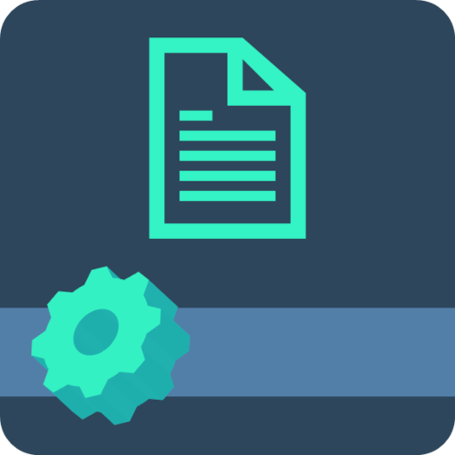
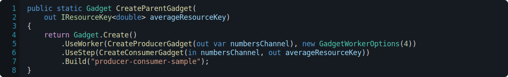
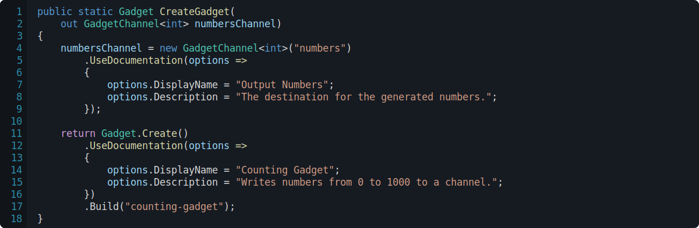

<h1>

Gadgetry
</h1>

**Gadgetry** is **C#** library for creating **long-running tasks** and **background workers**.

  

  
  
  
  
  
  

<h2>
  
  Steps
</h2>

A **step** will run one-after-another.

  
  <i>A gadget that utilises <b>steps</b>.</i>

<h2>
  
  Workers
</h2>

A **worker** will run in parallel with all other workers.

  
  <i>A gadget that utilises <b>workers</b> to execute <b>16 counters</b> in parallel.</i>

<h2>
  
  Channels
</h2>

A **channel** represents the flow of data from one Gadget to another.

  
  <i>A gadget that utilises a <b>producer</b> and a <b>consumer</b> in order to aggregate data.</i>

<h2>
  
  Resources
</h2>

A **resource** can be used to share state between Gadgets.

  
  <i>A <b>Gadget</b> that waits and writes a value to a <b>resource</b>.</i>

<h2>
  
  Documentation
</h2>

**Documentation** can be associated with a Gadget and other Gadget components.

  
  <i>A documented <b>Gadget</b> and <b>Channel</b>.</i>

<h2>
  
  Visualisation
</h2>

A **visualiser** is a model used to visualise the current state of a Gadget.

  
  <i>A <b>Gadget</b> with a visualiser for it's progress.</i>

