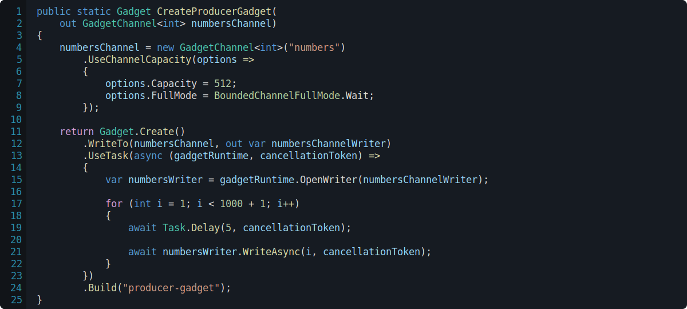
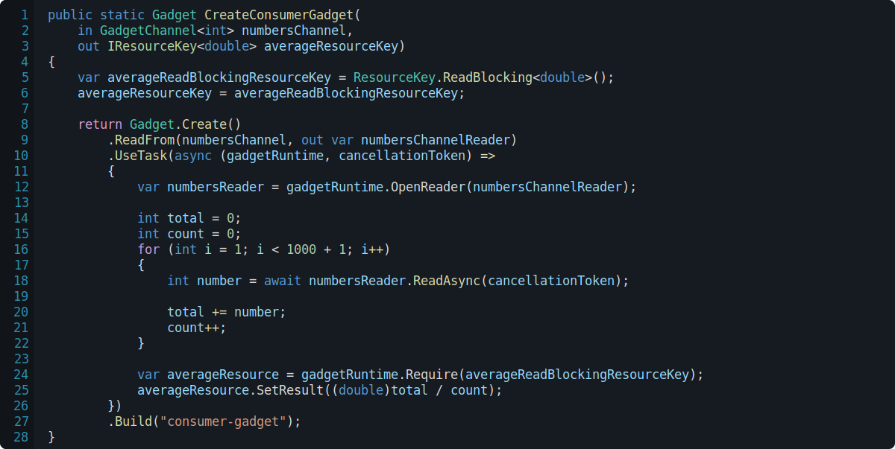

<h1>

Gadgetry.Channels
</h1>

A **channel** represents the flow of data from one Gadget to another.

  
  <i>A gadget that utilises a <b>producer</b> and a <b>consumer</b> in order to aggregate data.</i>

The producer gadget in this sample simply counts up to a value and writes to a channel every number in the sequence.

  
  <i>The producer gadget that counts up to <b>1,000</b> and writes all numbers in the sequence to the channel.</i>

And finally, the consumer gadget will read from the input channel and average all of the values together.

  
  <i>The consumer gadget that reads all values from channel and outputs the average.</i>

